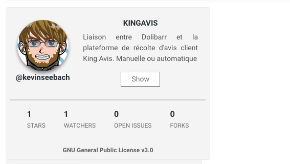

# my-github-profilecard

Display a github profile card in VueJS 2 from Github username



## How to use it in your own projet ?
* npm install my-vue-github-profile
* import MyVueGithubProfile from 'my-vue-github-profile'
* ```<MyVueGithubProfile username="yourusername"/>```
